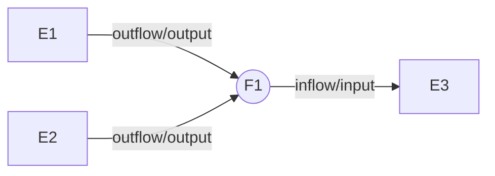

# I-O constraints

Generic constraints used for energy balancing. We use input/inflow and output/outflow interchangeably, depending on whether we are speaking about a flow (bus) or an entity (node).

- Flows: outflows, inflows
- Entities: input, output

## Energy balance

**io_balance**: balance the inflows and outflows of every flow "bus".

$$\forall_{f, y, d, h} \quad \sum\limits_{e \in FOE_{f}} fout_{f,e,y,d,h} = \sum\limits_{e \in FIE_{f}}fin_{f,e,y,d,h}$$

## Outflow limits

**flow_out_share_equal**: limit a flow's outflow to be equal a share of the sum of all its outflows. Skipped if $\mathbf{FOUTSREQ}$ is `None`.

$$\forall_{f,e,y,d,h} \quad fout_{f,e,y,d,h}=\mathbf{FOUTSREQ_{f,e,y}}\sum\limits_{ex \in FOE_{f}}fout_{f,ex,y,d,h}$$

**flow_out_share_max**: limit a flow's outflow to be below a share of the sum of all its outflows. Skipped if $\mathbf{FOUTSRMAX}$ is `None`.

$$\forall_{f,e,y,d,h} \quad fout_{f,e,y,d,h} \le \mathbf{FOUTSRMAX_{f,e,y}} \sum\limits_{ex \in FOE_{f}} fout_{f,ex,y,d,h} $$

**flow_out_share_min**: limit a flow's outflow to be below a share of the sum of all its outflows. Skipped if $\mathbf{FOUTSRMIN}$ is `None`.

$$\forall_{f,e,y,d,h} \quad fout_{f,e,y,d,h} \ge \mathbf{FOUTSRMIN_{f,e,y}} \sum\limits_{ex \in FOE_{f}} fout_{f,ex,y,d,h} $$

## Inflow limits

**flow_in_share_equal**: limit a flow's inflow to be equal a share of the sum of all its inflows. Skipped if $\mathbf{FINSREQ}$ is `None`.

$$\forall_{f,e,y,d,h} \quad fin_{f,e,y,d,h} = \mathbf{FINSREQ_{f,e,y}} \sum\limits_{ex \in FIE_{f}} fin_{f,ex,y,d,h} $$

**flow_in_share_max**: limit a flow's inflow to be below a share of the sum of all its inflows. Skipped if $\mathbf{FINSRMAX}$ is `None`.

$$\forall_{f,e,y,d,h} \quad fin_{f,e,y,d,h} \le \mathbf{FINSRMAX_{f,e,y}} \sum\limits_{ex \in FIE_{f}} fin_{f,ex,y,d,h}$$

**flow_in_share_min**: limit a flow's inflow to be above a share of the sum of all its inflows. Skipped if $\mathbf{FINSRMIN}$ is `None`.

$$\forall_{f,e,y,d,h} \quad fin_{f,e,y,d,h} \ge \mathbf{FINSRMIN_{f,e,y}} \sum\limits_{ex \in FIE_{f}} fin_{f,ex,y,d,h} $$

## Inputs

**input**: balance entity inflows to their activity, where $\boldsymbol{\eta }\mathbf{I}$  is the input efficiency.

$$\forall_{e, y, d, h} \quad \sum\limits_{f \in EIN_{e}}\boldsymbol{\eta }\mathbf{I_{f, e, y}} \cdot fin_{f,e,y,d,h} = a_{e,y,d,h}$$

**input_share_equal**: limit an entity's input to be a share of all its inputs. Skipped if $\mathbf{EINSREQ}$ is `None`.

$$\forall_{f,e,y,d,h} \quad fin_{f,e,y,d,h} = \mathbf{EINSREQ_{f,e,y}} \sum\limits_{fx \in EIN_{e}} fin_{fx,e,y,d,h} $$

**input_share_max**: limit an entity's input to be below a share of all its inputs. Skipped if $\mathbf{EINSRMAX}$ is `None`.

$$\forall_{f,e,y,d,h} \quad fin_{f,e,y,d,h} \le \mathbf{EINSRMAX_{f,e,y}} \sum\limits_{fx \in EIN_{e}} fin_{fx,e,y,d,h}$$

**input_share_min**: limit an entity's input to be above a share of all its inputs. Skipped if $\mathbf{EINSRMIN}$ is `None`.

$$\forall_{f,e,y,d,h} \quad fin_{f,e,y,d,h} \ge \mathbf{EINSRMIN_{f,e,y}} \sum\limits_{fx \in EIN_{e}} fin_{fx,e,y,d,h}$$

## Outputs

**output**: balance entity outputs to their activity, where $\boldsymbol{\eta }\mathbf{O}$  is the output efficiency.

$$\forall_{e, y, d, h} \quad a_{e,y,d,h} = \sum\limits_{f \in EOUT_{e}} \frac{fout_{f,e,y,d,h}}{\boldsymbol{\eta }\mathbf{O_{f, e, y}}}$$

**output_share_equal**: limit an entity's output to be a share of all its outputs. Skipped if $\mathbf{EOUTSREQ}$ is `None`.

$$\forall_{f,e,y,d,h} \quad fout_{f,e,y,d,h} = \mathbf{EOUTSREQ_{f,e,y}} \sum\limits_{fx \in EOUT_{e}} fout_{fx,e,y,d,h} $$

**output_share_max**: limit an entity's output to be below a share of all its outputs. Skipped if $\mathbf{EOUTSRMAX}$ is `None`.

$$\forall_{f,e,y,d,h} \quad fout_{f,e,y,d,h} \le \mathbf{EOUTSRMAX_{f,e,y}} \sum\limits_{fx \in EOUT_{e}} fout_{fx,e,y,d,h} $$

**output_share_min**: limit an entity's output to be above a share of all its outputs. Skipped if $\mathbf{EOUTSRMIN}$ is `None`.

$$\forall_{f,e,y,d,h} \quad fout_{f,e,y,d,h} \ge \mathbf{EOUTSRMIN_{f,e,y}} \sum\limits_{fx \in EOUT_{e}} fout_{fx,e,y,d,h} $$

# Capacity constraints

Generic constraints related to entity capacity.

**cap_max_annual**: limit the maximum installed capacity of a specific entity. Skipped if $\mathbf{CMAXANN}$ is `None`.

$$\forall_{e,y} \quad ctot_{e,y} \le \mathbf{CMAXANN_{e,y}}$$

**cap_transfer**: transfer installed new capacity and residual capacity between year slices. $\mathbf{RESCAP}$ is the residual capacity installed before the modeled period. Setting $\mathbf{LIFE}$ to `None` implies the technology has infinite lifetime (no retirement).

$$\forall_{e,y} \quad ctot_{e,y} =
\mathbf{RESCAP_{e,y}} + \sum\limits_{\begin{align*}
yx&= Y_{0} \\
\text{if } y-yx &< \mathbf{LIFE_{e}}
\end{align*}}^{y} cnew_{e,y}$$

**cap_max_new**: limit the maximum new capacity installed per year. Skipped if $\mathbf{CMAXNEW}$ is `None`.

$$\forall_{e,y} \quad cnew_{e,y} \le \mathbf{YL}\cdot \mathbf{CMAXNEW_{e,y}}$$

**cap_build_rate**: limit the rate of growth of an entity's capacity. Skipped if $\mathbf{BR}$ is `None`.

$$\forall_{e,y} \quad ctot_{y,e} \le \mathbf{BR^{YL}} \cdot ctot_{e,y-\mathbf{YL}}$$

# Activity constraints

Generic constraints related to an entity's activity, unrelated to its inflows and outflows.

**act_ramp_up**: limit the hourly activity increment of a technology. Skipped if $\mathbf{RAMPR \cdot HL} \ge 1$ or if it is `None`.

$$\forall_{e,y,d,h} \quad a_{e,y,d,h}-a_{e,y,d,h-1} \le \mathbf{HL \cdot RAMPR_{e,y}} \cdot \mathrm{HourlyC2A_{e,y}} \cdot ctot_{e,y}$$

**act_ramp_down**: limit the hourly activity decrement of a technology. Skipped if $\mathbf{RAMPR \cdot HL} \ge 1$ or if it is `None`.

$$\forall_{e,y,d,h} \quad a_{e,y,d,h}-a_{e,y,d,h-1} \le \mathbf{HL \cdot RAMPR_{e,y}} \cdot \mathrm{HourlyC2A_{e,y}} \cdot ctot_{e,y}$$

>**Important:** Representative day linkage
>
>Users must keep in mind that representative days are disconnected from one another. This means that the ramp up/down between the end of a day and the beginning of another is not represented in the current version of the model.

**act_max_annual**: limit the maximum annual activity a specific entity. Skipped if $\mathbf{AMAXANN}$ is `None`.

$$\mathrm{TotalAnnualAct_{e,y}} \le \mathbf{AMAXANN_{e,y}}$$

**act_cf_max_hour**: set the maximum hourly utilization of an entity's capacity.

$$\forall_{e,y,d,h} \quad a_{e,y,d,h} \le \mathbf{CFMAX_{e,y}} \cdot \mathrm{HourlyC2A_{e,y}} \cdot ctot_{e,y}$$

**act_cf_min_hour**: set the minimum hourly utilization of an entity's capacity.

$$\forall_{e,y,d,h} \quad \mathbf{CFMIN_{e,y}} \cdot \mathrm{HourlyC2A_{e,y}} \cdot ctot_{e,y} \le a_{e,y,d,h}$$

**act_cf_max_annual**: set the maximum annual utilization of an entity's capacity.

$$\forall_{e,y} \quad \mathrm{TotalAnnualAct_{e,y}} \le \mathbf{CFMAX_{e,y}} \cdot \mathbf{C2A_{e,y}} \cdot ctot_{e,y}$$

**act_cf_min_annual**: set the maximum annual utilization of an entity's capacity.

$$\forall_{e,y} \quad \mathbf{CFMIN_{e,y}} \cdot \mathbf{C2A_{e,y}} \cdot ctot_{e,y} \le \mathrm{TotalAnnualAct_{e,y}}$$

>**Important:** Hourly vs annual Capacity Factor constraints
>
>The primary distinction between these two options lies in the extent of flexibility they allow. The yearly version permits maximum technology output during certain hours of the year, while constraining the cumulative annual activity. This makes it suitable for representing peaking technologies such as CCGT. On the other hand, some types of nuclear generators have high startup costs and typically remain operational throughout the year. Therefore, a minimum hourly constraint can be imposed on them to ensure realistic behavior.

