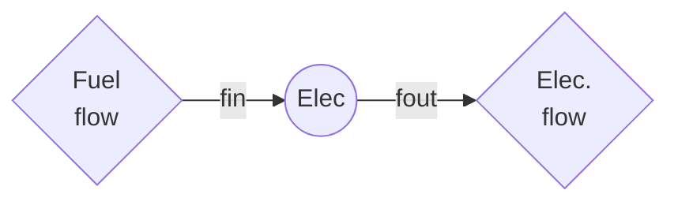

Group identifier: `_convchp_` and `_convelec_`

The electricity sector represents energy conversion facilities for both combustion-based technologies and non-combustion renewables (PV, Wind, Hydro).

Variable costs must not include fuel costs, since that is handled by either the trade or the extraction modules.

# Sets

| Name                          | Set   | Symbol | Description                                                                   |
| ----------------------------- | ----- | ------ | ----------------------------------------------------------------------------- |
| Variable renewable generation | $VRE$ | $e$    | A sub-class of entities that require capacity factor that varies by the hour. | 

# Constraints  

**act_cf_max_hour**: maximum hourly utilisation of capacity.

$$\forall_{e,y,d,h} \quad a_{e,y,d,h} \le \begin{cases}
\mathbf{CFMAX_{e,y}} \cdot \mathrm{HourlyC2A_{e,y}} \cdot ctot_{e,y} &\quad \text{if } e \notin VRE\\
\mathbf{VREMAX_{e,y,d,h}} \cdot \mathrm{HourlyC2A_{e,y}} \cdot ctot_{e,y} &\quad \text{if } e \in VRE
\end{cases}$$

**cap_peak**: peak capacity must be met excluding imports (full autarky).

$$\forall_{y} \quad \sum\limits_{e} ctot_{e,y} \cdot \boldsymbol{\eta }\mathbf{O_{elecsupply, e, y}} \cdot \mathbf{PKRT_{e,y}} \ge (1+ \mathbf{CAPMARGIN_{y}}) \ \mathbf{PKDEM_{y}}$$

**cap_base**: meet base demand requirement, including export capacity as another source of flexibility.

$$\forall_{y} \quad \mathbf{BSDEM_{y}} \ge \sum\limits_{e \notin TRADE} ctot_{e,y} \cdot \boldsymbol{\eta }\mathbf{O_{elecsupply, e, y}} \cdot \mathbf{CFMIN_{e,y}} - \sum\limits_{e \in TRADE} ctot_{e,y} \cdot \boldsymbol{\eta }\mathbf{O_{elecsupply, e, y}}$$