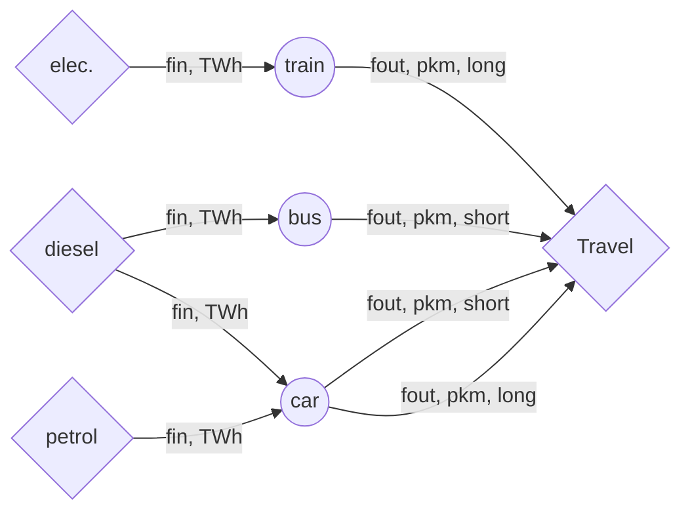

Group identifier: `_convpass_`

>**Important**: this file describes unique functions in the module. To see the generic constraints used by the module, please see the code.

The passenger sector represents represents transport of people. Entities are specific transport technologies (cars, buses, etc.), 
with their input being one or several energy flows (either fuel or electricity), their activity being defined as vehicle kilometres travelled (vkm), and their outputs defined in passenger kilometres travelled (pkm).

For now, only two types of travel are described in the model (short, long), each with their specific speeds. However, more specific travel ranges can be easily set up.

# Constraints  

**travel_time_budget**: Limit the available time for travel each year based on the average time each person travels in a day ($\mathbf{TRAVELTIME}$).
See Daly et al. 2014. 10.1016/j.apenergy.2014.08.051 for more information.

$$\forall_{y} \quad 365\cdot\mathbf{POPUL_{y} \cdot TRAVELTIME_{y}} \ge 10^{6} \cdot  \sum\limits_{e \in Passenger} \sum\limits_{f \in EOUT_{e}} \frac{\mathrm{TotalAnnualOutflow_{f,e,y}}}{\mathbf{SPEED_{f,e,y}}}$$

# Word of caution

By request, RESTORE does not include vintages in its formulation (see TIMES/TEMOA documentation for more information). This means technologies with big temporal improvements will not be represented adequately. In the case of transport, this means cars installed in 1995 will "inherit" the efficiency and emission factors of future years (i.e., they will magically improve). Please account for this when interpreting results!