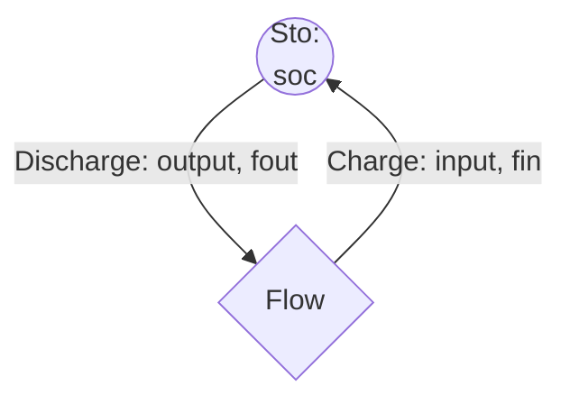

Group identifier: `_sto_`

Storage entities are characterised by their charge/discharge and state-of-charge.

# Seasonal storage (Kotzur)

This will be implemented once the representative day algorithm in D-EXPANSE is fixed (weather synchronicity). See https://doi.org/10.1016/j.apenergy.2018.01.023 for more information.

# Cyclic storage

The simplest storage method, taken from PyPSA. Only allows storage flexibility within the day-range. Similarly, the SoC starts at the same energy level each year, regardless of the added capacity. Equations based on PyPSA (with small adaptations).

See: https://pypsa.readthedocs.io/en/latest/optimal_power_flow.html#storage-unit-constraints

## Parameters  

**Initial State of Charge**: the initial SoC, to be set in all years and representative days at $H_{0}$. $\mathbf{INISOCR_{e}}$ allows users to change how full the storage is (0 to 100%).

$$\mathrm{IniSoC_{e}} = \mathbf{C2A_{e}} \ \mathbf{INISOCR_{e}} \ \mathbf{CRATE_{e}}\ \mathbf{ACTUALCTOT_{e,Y_{0}}}$$

## Constraints

**activity_setup**: storage activity is the sum of charge and discharge (accounting for efficiencies).

$$\forall_{e,y,d,h} \quad a_{e,y,d,h} = \sum\limits_{f \in EIN_{e}} \boldsymbol{\eta }\mathbf{I_{f, e, y}} \ fin_{f,e,y,d,h} + \sum\limits_{f \in EOUT_{e}} \ \frac{fout_{f,e,y,d,h}}{\boldsymbol{\eta }\mathbf{O_{f, e, y}}}$$

**charge_limit**: limit the storage charge to the available capacity.

$$\forall_{e,y,d,h} \quad \sum\limits_{f \in EIN_{e}} fin_{f,e,y,d,h} \le \mathbf{C2A_{e,y}}\ ctot_{e,y}$$  

**discharge_limit**: limit the storage depletion to the available capacity.

$$\forall_{e,y,d,h} \quad \sum\limits_{f \in EOUT_{e}} fout_{f,e,y,d,h} \le \mathbf{C2A_{e,y}}\ ctot_{e,y}$$

**soc_limit**: limit the state-of-charge to the available energy capacity.  

$$\forall_{e,y,d,h} \quad 0 \le soc_{e,y,d,h} \le \mathbf{CRATE_{e}} \ \mathbf{C2A_{e,y}}\ ctot_{e,y}$$

**soc_flow**: relation between input, output and the SoC. The first option forces the SoC to always start at the same energy level each year.

$$\forall_{e,y,d,h} \quad soc_{e,y,d,h} = \begin{cases} \mathrm{IniSoC_{e}} + \mathbf{HL} \ (\sum\limits_{f \in EIN_{e}} \boldsymbol{\eta }\mathbf{I_{f, e, y}} \ fin_{f,e,y,d,h} - \sum\limits_{f \in EOUT_{e}} \ \frac{fout_{f,e,y,d,h}}{\boldsymbol{\eta }\mathbf{O_{f, e, y}}}) \quad \text{if } h ==H_{0}\\

(\boldsymbol{\eta }\mathbf{ST_{f, e, y}})^{\mathbf{HL}} \ soc_{e,y,d,h-\mathbf{HL}} + \mathbf{HL}\ (\sum\limits_{f \in EIN_{e}} \boldsymbol{\eta }\mathbf{I_{f, e, y}} \ fin_{f,e,y,d,h} - \sum\limits_{f \in EOUT_{e}} \ \frac{fout_{f,e,y,d,h}}{\boldsymbol{\eta }\mathbf{O_{f, e, y}}}) \quad \text{otherwise}

\end{cases}$$

**soc_intra_day_cyclic**: forces the SoC to be the same at the start and end of a representative day.

$$\forall_{e,y,d} \quad soc_{e,y,d,H_{0}} = soc_{e,y,d,|H|}$$

**soc_initial**: sets the initial SoC for all days in all years to be the same. Necessary to avoid "free" energy appearing when capacity increases.

$$\forall_{e,y,d} \quad soc_{e,y,d,H_{0}} = \mathrm{IniSoC_{e}}$$