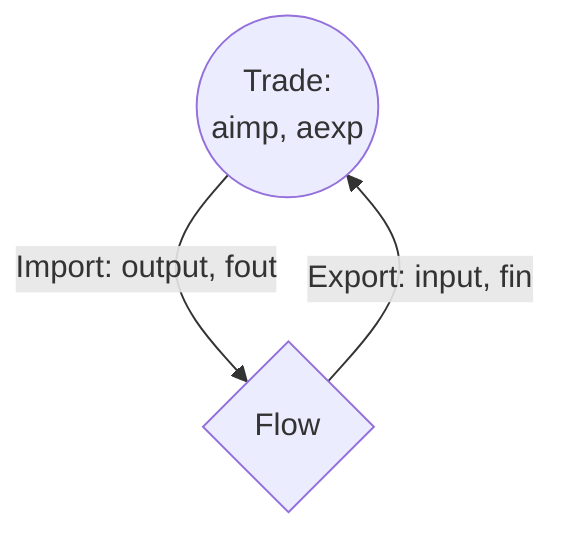

Group identifier: `_trd_`

>**Important**: this file describes unique functions in the module. To see the generic constraints used by the module, please see the code.

Trade entities are able to produce or buy a flows for specific prices. Users can enable/disable if a specific trade entity is able to import or export via configuration commands.

For now, trade prices are constant through the year, but it would be ideal to make them time-series since it would lead to more realistic behaviour!

# Expressions

**total_annual_import**: the sum of all the import (output) connections.

$$\forall_{e,y} \quad \mathrm{TotalAnnualImport_{e,y}} = \sum\limits_{d \in D} \mathbf{DL_{y,d}} \sum\limits_{h \in H} \mathbf{HL}\ aimp_{e,y,d,h}$$

**total_annual_export**: the sum of all the export (input) connections.

$$\forall_{e,y} \quad \mathrm{TotalAnnualExport_{e,y}} = \sum\limits_{d \in D} \mathbf{DL_{y,d}} \sum\limits_{h \in H} \mathbf{HL}\ aexp_{e,y,d,h}$$

**cost_variable_om**: total variable cost due to trade. The Import or Export portion might be skipped depending on the configuration.

$$
\forall_{e}\quad \mathrm{CostVarOM_{e}} = \sum\limits_{y}\mathbf{DR_{y}}( \mathbf{CIMP_{e,y}} \mathrm{TotalAnnualImport_{e,y}} - \mathbf{REXP_{e,y}} \ \mathrm{TotalAnnualExport_{e,y}})
$$

# Constraints  

**activity_setup**: for trade, total activity is equal to the sum of imports and exports, with $aexp$ and $aimp$ being set to cero if export/import is disabled, respectively.

$$\forall_{e,y,d,h} \quad a_{e,y,d,h} = aimp_{e,y,d,h} + aexp_{e,y,d,h}$$

**flow_in**: balance entity inflows to export activity.

$$\forall_{e, y, d, h} \quad \sum\limits_{f \in EIN_{e}}\boldsymbol{\eta }\mathbf{I_{f, e, y}} \cdot fin_{f,e,y,d,h} = aexp_{e,y,d,h}$$

**flow_out**: balance entity outflow to import activity, where $\boldsymbol{\eta }\mathbf{O}$ is the output efficiency.

$$\forall_{e, y, d, h} \quad aimp_{e,y,d,h} = \sum\limits_{f \in EOUT_{e}} \frac{fout_{f,e,y,d,h}}{\boldsymbol{\eta }\mathbf{O_{f, e, y}}}$$

**act_max_import_annual**: limit maximum import. Skipped if $\mathbf{AMAXANN}$ is `None`.

$$\forall_{e,y} \quad \mathrm{TotalAnnualImport_{e,y}} \le \mathbf{AMAXANN_{e,y}}$$

**act_max_export_annual**: limit maximum export. Skipped if $\mathbf{AMAXANN}$ is `None`.

$$\forall_{e,y} \quad \mathrm{TotalAnnualExport_{e,y}} \le \mathbf{AMAXANN_{e,y}}$$

>**Important:** Maximum activity
>
>In future releases, this should be different for imports and exports.
